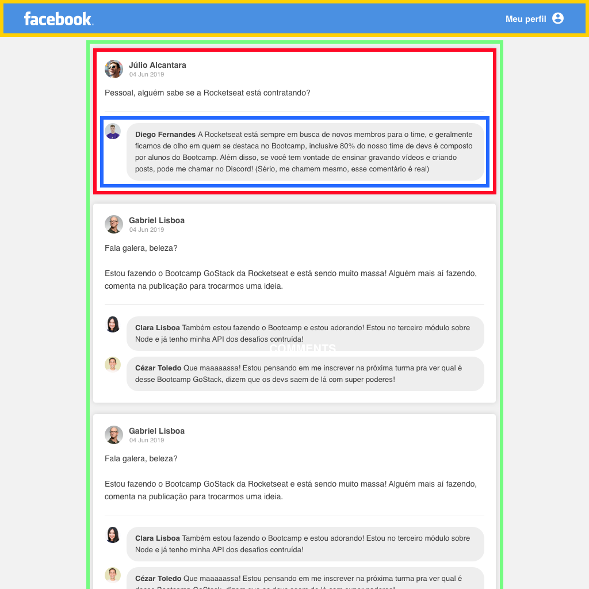

<h3 align="center">
    Facebook Timeline (ReactJS)
</h3>

<p align="center">“Sucesso não é o resultado de um jogo, mas o destino de uma jornada”!</blockquote>

<p align="center">
  

  <a href="https://rocketseat.com.br">
    
  </a>

  

  <a href="https://github.com/Rocketseat/bootcamp-gostack-desafio-04/stargazers">
    
  </a>
</p>

<p align="center">
  <a href="#information_source-sobre-a-aplicação">Sobre a aplicação</a>&nbsp;&nbsp;&nbsp;|&nbsp;&nbsp;&nbsp;
  <a href="#rocket-tecnologias-utilizadas">Tecnologias Utilizadas</a>&nbsp;&nbsp;&nbsp;|&nbsp;&nbsp;&nbsp;
  <a href="#memo-licença">Licença</a>
</p>

## :information_source: Sobre a aplicação

A aplicação desenvolvida têm intuito único e exclusivo para aprendizado do ecossistema ReactJS.
Se trata de uma interface semelhante a timeline da rede social Facebook.

## :rocket: Tecnologias Utilizadas

- [Webpack](https://webpack.js.org/)
- [Babel](https://babeljs.io/)
- [Webpack Dev Server](https://webpack.js.org/configuration/dev-server/)
- [ReactJS](https://pt-br.reactjs.org/)

### Tela da aplicação


### Componentes



**Header (Amarelo):** Responsável por exibir a logo e o link para acessar o perfil;

**PostList (Verde):** Responsável por armazenar os dados da listagem de post, esses dados devem ficar dentro do `state` do componente e não em uma variável comum, por exemplo:

```js
import React, { useState } from 'react';

import data from '../assets/data.json';

function PostList() {
    const [posts,] = useState(data);

    return (
        ...
    );
}
```

**Post (Vermelho):** Responsável por exibir os dados do post, esses dados devem vir através de uma propriedade recebida do componente PostList, ou seja, lá no PostList você terá algo assim:

```js
posts.map(post => <Post key={post.id} data={post} />);
```

**Comment (Azul):** Responsável por exibir um comentário. Os dados do comentário virão por uma propriedade do componente. Dentro do componente Post você terá um novo `.map` para listar os comentários do post:

```js
data.comments.map(comment => <Comment key={comment.id} data={comment} />);
```

## :memo: Licença

Esse projeto está sob a licença MIT. Veja o arquivo [LICENSE](LICENSE.md) para mais detalhes.

---

Feito com ♥ by Maciel Santos
